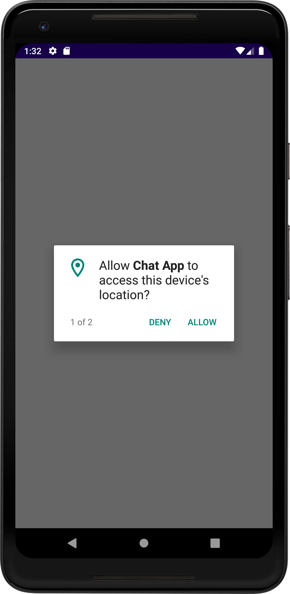
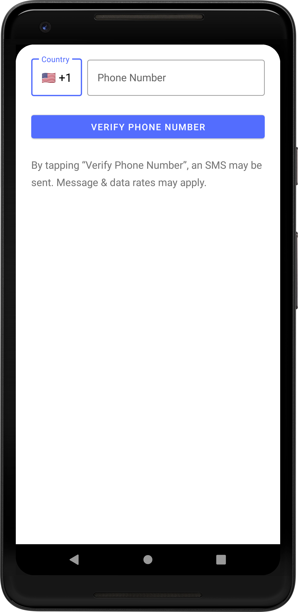
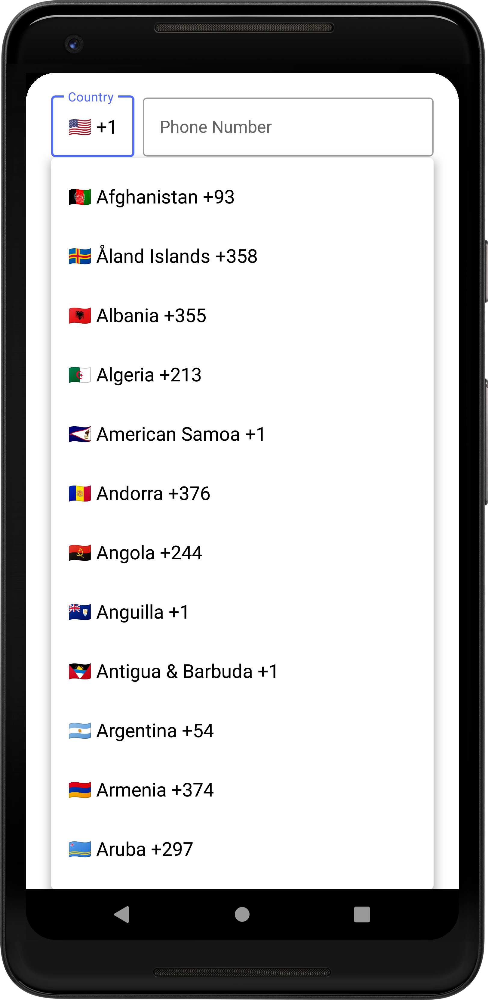
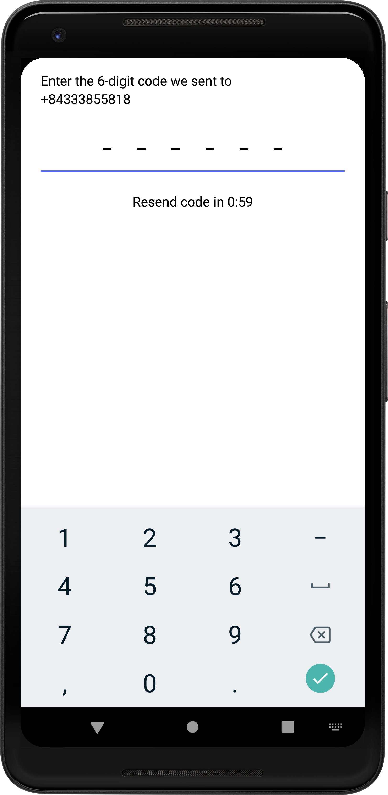
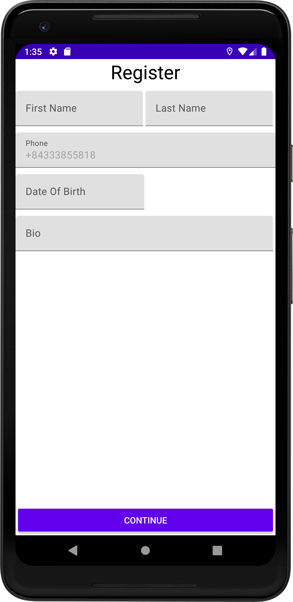
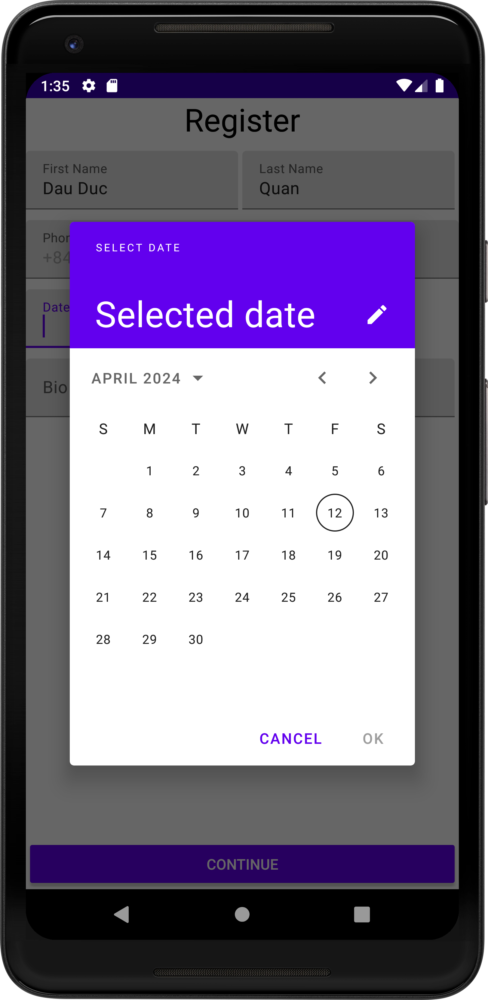
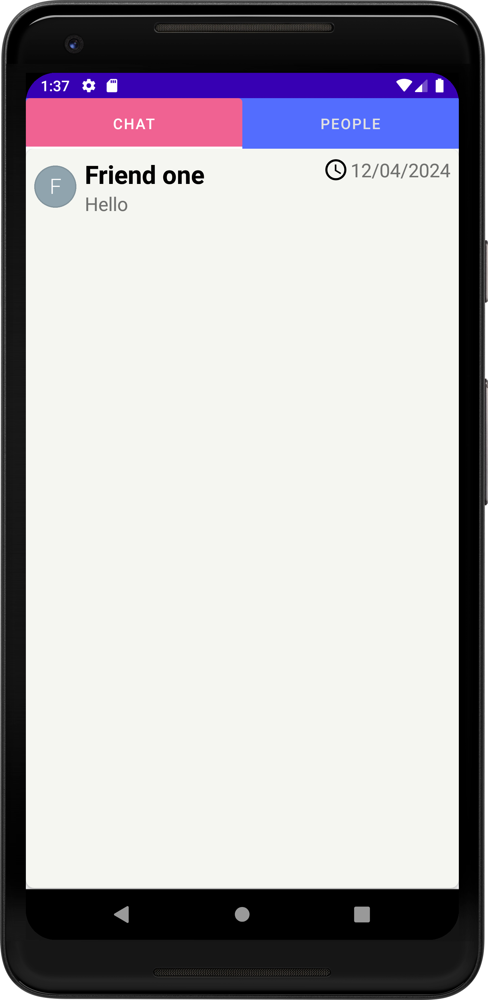
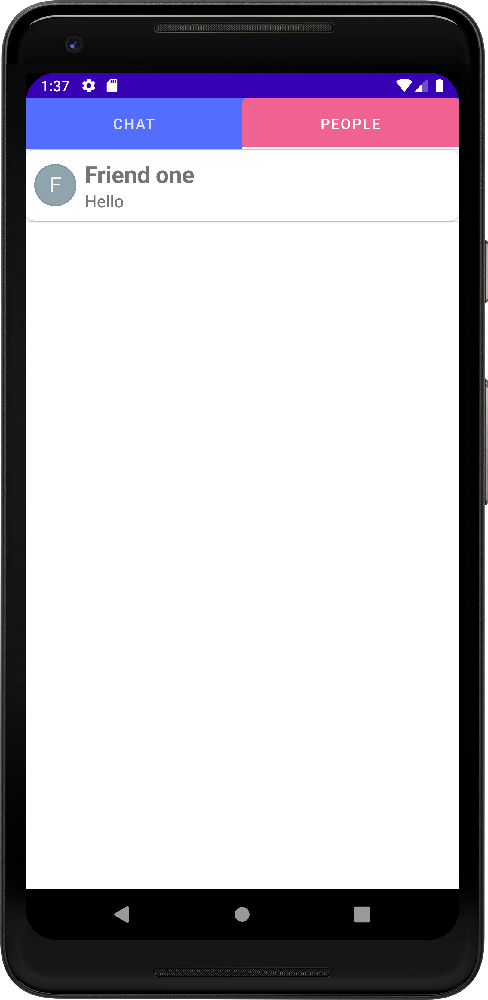
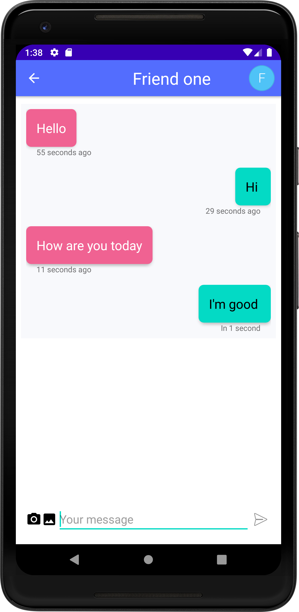

# Chat-App
A simple chat app using firebase 

- Utilized XML, Firebase Authentication, Firebase Realtime Database, Dexter, MVC...
### Features:
- Implemented Firebase’s Phone Authentication feature, allowing users to sign up and sign in seamlessly.
- Enabled users to send and receive text messages in real-time, enhancing the user interaction experience.
- Provided features for users to view a list of friends and ongoing chats, making navigation within the app user-friendly.

| |  | |
|---|---|---|
|  |  |  |
|  |  |  |
|  |  |  |

